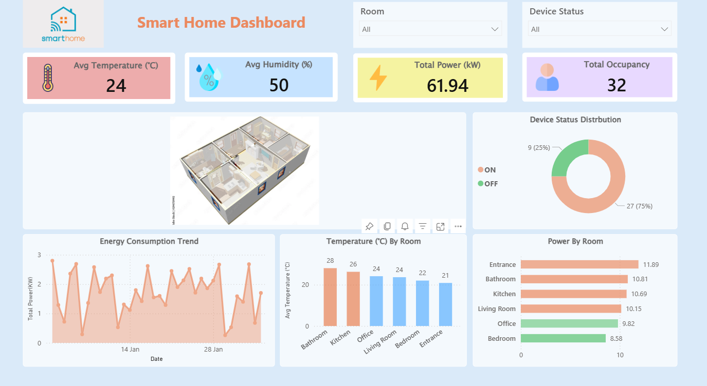

# Smart Home Monitoring Dashboard

## Project Overview

This project presents an **interactive Power BI dashboard** designed to monitor and analyze smart home sensor data.

The dashboard provides visual insights into key environmental and operational metrics across different rooms in a house.

The dashboard helps track:
- Temperature conditions in each room
- Humidity levels
- Energy consumption patterns
- Device activity status
- Occupancy and motion detection

---

## Dashboard Features

The dashboard includes several interactive components.

### KPI Cards

- Average Temperature (°C)
- Average Humidity (%)
- Total Power Consumption (kW)
- Total Occupancy

These KPIs provide a quick summary of the overall smart home environment.

---

### Data Visualizations

The dashboard includes multiple visualizations to analyze sensor data:

- **Energy Consumption Trend**
  - Displays power usage trends over time.

- **Temperature by Room**
  - Compares temperature levels across different rooms.

- **Power Consumption by Room**
  - Identifies which rooms consume the most energy.

- **Device Status Distribution**
  - Shows the percentage of devices that are ON vs OFF.

---

### Interactive Filters

Users can interact with the dashboard using slicers:

- **Room Filter**
- **Device Status Filter**

---

## Tools Used

Power BI

DAX (Data Analysis Expressions)

Data Modeling

Synoptic Panel Visual

---

## This dashboard helps users:

Monitor environmental conditions in the house

Identify rooms with higher energy consumption

Track device activity and operational status

Understand occupancy and motion patterns

---

